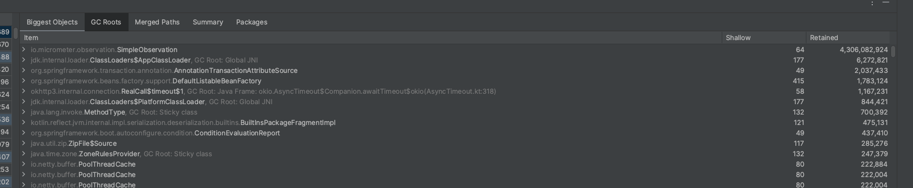

# OpenTelemetry Potential Memory Leak

## Introduction
This repo represents a potential problem with OpenTelemetry within a reactive SpringBoot. It is setup to use r2dbc and oauth2 because both seem to be a factor. 
The problem exhibits itself as a memory leak by allowing for a large number of `io.micrometer.observation.SimpleObservation` objects to be allocated and never
fully released. This eventually leads to OOM exceptions in some cases.

## Design
This repo is built in three parts:
* server— a WebFlux Spring Boot server application which fronts a posgres database to simple Geography entities.
* client— a Ktor client that makes REST calls to create Geography entities
* model— a library representing the shared entities between the server and client

## Usage
### Setup 
1. Postgres— start postgres server locally with default values. In order to run in Docker, you can use the following:
```shell
$> docker run -itd -e POSTGRES_USER=postgres -e POSTGRES_PASSWORD=password -p 5432:5432 -v test-data:/var/lib/postgresql/data --name postgresql postgres
```
1. Start the server— start the Spring Boot server
```shell
$> ./gradlew :server:bootRun
```

### Running the test
To see the problem, you will need a memory profiler such as the one that ships with IntelliJ. There are two tests included. The first test reads from a file and
creates ~3000 entities. The second test will create 1000 random entities for each state.
After each test, you will see a large number of `SimpleObservation` entities retrained in memory and never freed.

In order to run the first test, run the following:
```shell
$> ./gradlew :client:runGeographyImporter
```
NOTE: Between runs of this tests, you will want to truncate the `ts_geography` table.

In order to run the second test, run the following:
```shell
$> ./gradlew :client:runRandomImporter
```

### Results
After running the tests, you will find the service is retaining a lot more memory than expected. It seems with this particular configuration, the collection of
Open Telemetry spans is not being released. If you use a memory profiler, such as the one that ships with IntelliJ, you observe `SimpleObservation` has a large 
footprint of memory retained.



## Findings
It seems that there are a number of factors at work to cause the problem. 
* Project Reactor's automatic context propagation
* Spring Security
* r2dbc connection pooling
Eliminating any of these will either eliminate the problem or reduce the footprint of the problem. I've not been able to narrow the problem down further.

